<div align="center">

# 🧭 AI Engineering Interview Roadmap

### من أول Python إلى بناء أنظمة ML وAutomation وAgentic AI جاهزة للإنتاج

<p>
  
  
  
  
</p>

<p><strong>خطة عملية مفتوحة المصدر للتحضير للمذاكرة، بناء المشاريع، واجتياز مقابلات AI/ML Engineering.</strong></p>

[ابدئي من هنا](#-كيف-تستخدمي-الريبو) · [الخطة الكاملة](#-الخطة-الموحدة) · [المشاريع](#-portfolio-projects) · [المقابلات](#-interview-prep) · [المصادر](#-free-resources) · [Study Tracker](templates/study-tracker.md)

</div>

> **الفكرة الأساسية:** لا تدرسي الأدوات كقائمة منفصلة. ابنِي أساسًا قويًا، ثم طبّقي كل مفهوم في مشروع قابل للشرح في المقابلة، ثم أضيفي الاختبارات والمراقبة والتكلفة والأمان.

---

## 🎯 لمن هذا الريبو؟

هذا الريبو مناسب لمن تريد الانتقال تدريجيًا من البرمجة وعلوم البيانات إلى أدوار **ML Engineer، AI Engineer، Applied Scientist، Automation Engineer، LLM/Agent Engineer**. لا يفترض أن تكون لديك خبرة سابقة، لكنه يفترض الالتزام بالتطبيق لا المشاهدة فقط.

### مخرجات الرحلة

| المخرج | كيف نثبته؟ |
|---|---|
| أساس برمجي قوي | تمارين Python، Git، SQL، Linux واختبارات صغيرة |
| فهم ML حقيقي | نماذج baseline، مقاييس، منع data leakage، وتفسير النتائج |
| خبرة Production | API، Docker، CI، logging، monitoring، وإدارة التجارب |
| خبرة AI حديثة | Embeddings، RAG، tool calling، agents، evaluation، وMCP |
| Portfolio قابل للمراجعة | 8 مشاريع متدرجة مع README ونتائج ومقابلة تجريبية لكل مشروع |
| جاهزية مقابلات | أسئلة fundamentals، system design، ML case studies، وbehavioral stories |

---

## 🧭 كيف تستخدمي الريبو؟

1. ابدئي بـ **Level 0** حتى لو كنتِ تعرفين بعض المواضيع؛ الهدف هو سد الفجوات.
2. لكل مستوى: ادرسي المفاهيم، نفّذي الـmilestones، ثم أنجزي مشروعًا واحدًا على الأقل.
3. لا تنتقلي للمستوى التالي قبل أن تستطيعي شرح: **المشكلة، الافتراضات، baseline، المقياس، trade-offs، وما الذي قد يفشل**.
4. استخدمي ملف [`docs/study-plan-12-weeks.md`](docs/study-plan-12-weeks.md) إذا أردتِ مسارًا مكثفًا لمدة 12 أسبوعًا.
5. سجّلي تقدمك في [`PROGRESS.md`](PROGRESS.md)، وحدثي المشاريع بصور ونتائج حقيقية بدل نسخ notebooks.

### قاعدة المذاكرة 30/50/20

| النسبة | النشاط |
|---:|---|
| 30% | Concepts: قراءة وفهم وشرح بصوت عالٍ |
| 50% | Building: كود، تجارب، debugging، ونسخ أولية |
| 20% | Interview: أسئلة، system design، ومراجعة أخطاء |

---

## 🗺️ الخطة الموحدة

```mermaid
flowchart LR
    A[0. Setup & Python] --> B[1. CS + Data]
    B --> C[2. ML Foundations]
    C --> D[3. Deep Learning]
    D --> E[4. Production ML]
    E --> F[5. Automation & APIs]
    F --> G[6. LLM Engineering]
    G --> H[7. Agentic AI]
    H --> I[8. Production Agents]
    I --> J[Interview Loop]
```



### Level 0 — Setup & Python Essentials

**الهدف:** كتابة كود واضح يمكن اختباره وتشغيله من الطرفية. تعلّمي Python، virtual environments، Git/GitHub، Linux basics، debugging، typing، pytest، وقراءة JSON/CSV.

**معايير الإتمام:** CLI صغيرة، tests تغطي الحالات الأساسية، README للتشغيل، وcommit history مفهوم.

### Level 1 — CS, Data & Mathematical Intuition

**الهدف:** بناء intuition بدل حفظ الصيغ. غطي Big-O، هياكل البيانات، SQL joins/window functions، الاحتمالات، الإحصاء الوصفي، linear algebra basics، وgradient intuition.

**معايير الإتمام:** حل 40 سؤالًا متدرجًا، تحليل dataset، وشرح لماذا correlation لا تعني causation.

### Level 2 — Machine Learning Foundations

**الهدف:** فهم supervised/unsupervised learning، linear/logistic regression، trees، ensembles، clustering، feature engineering، cross-validation، metrics، class imbalance، overfitting، وdata leakage.

**معايير الإتمام:** baseline بسيط قبل tuning، experiment log، error analysis، وشرح اختيار metric حسب تكلفة الخطأ.

### Level 3 — Deep Learning & Representation Learning

**الهدف:** PyTorch، tensors/autograd، training loop، regularization، CNNs، sequence/transformer intuition، embeddings، transfer learning، وfine-tuning basics.

**معايير الإتمام:** تدريب نموذج من الصفر، تسجيل التجارب، حفظ checkpoint، وكتابة تقرير عن failure modes.

### Level 4 — Production ML / MLOps

**الهدف:** تحويل notebook إلى خدمة. ادرسي packaging، FastAPI، Docker، model registry، data/versioning، batch vs online inference، CI، monitoring، drift، latency، cost، وrollback.

**معايير الإتمام:** endpoint موثق، container يعمل، tests، health check، metrics، وarchitecture diagram.

### Level 5 — Automation Engineering

**الهدف:** أتمتة workflows موثوقة، لا مجرد scripts. غطي REST APIs، webhooks، OAuth concepts، retries/backoff، idempotency، queues، scheduling، browser automation، RPA، n8n، وsecrets management.

**معايير الإتمام:** workflow يعالج failure paths، يسجل audit trail، ويمكن تشغيله محليًا من `.env.example` بدون أسرار.

### Level 6 — LLM Application Engineering

**الهدف:** بناء تطبيقات LLM قابلة للقياس. غطي prompting، structured output، function/tool calling، token/cost budgeting، embeddings، chunking، vector search، RAG، reranking، citations، guardrails، وevaluation.

**معايير الإتمام:** dataset تقييم صغير، مقاييس faithfulness/relevance، اختبارات regression، وfallback واضح عند عدم معرفة الإجابة.

### Level 7 — Agentic AI

**الهدف:** فهم متى نستخدم workflow deterministic ومتى نستخدم agent. ادرسي planning، tool selection، state، memory، multi-step execution، human-in-the-loop، permissions، sandboxes، LangGraph/Smolagents/LlamaIndex، وMCP.

**معايير الإتمام:** agent محدود الصلاحيات، أدوات typed، traces، budget/timeout، حالات رفض، وتقييم end-to-end.

### Level 8 — Production-Grade AI Systems

**الهدف:** التصميم على مستوى الشركات. غطي reliability، observability، security، prompt injection، PII، access control، multi-tenancy، caching، async jobs، load testing، disaster recovery، وmodel/provider abstraction.

**معايير الإتمام:** design doc، threat model، SLOs، cost estimate، runbook، وincident postmortem تجريبي.

---

## 🧪 Portfolio Projects

| # | المشروع | المستوى | المهارات المثبتة | سؤال مقابلة يجب أن تجيبي عنه |
|---:|---|---|---|---|
| 1 | **Data Quality CLI** | 0–1 | Python, CLI, pytest, CSV/JSON | كيف تضمنين أن pipeline لا يمرر بيانات تالفة؟ |
| 2 | **Churn Prediction API** | 2–4 | ML, metrics, FastAPI, Docker, monitoring | لماذا اخترتِ PR-AUC أو Recall بدل Accuracy؟ |
| 3 | **Document Automation Hub** | 5 | APIs, webhooks, retries, queues, n8n | كيف تمنعين تكرار تنفيذ webhook؟ |
| 4 | **Semantic Search for Arabic Docs** | 3–6 | embeddings, multilingual retrieval, RAG | كيف تقيسين جودة الاسترجاع قبل جودة الإجابة؟ |
| 5 | **Citation-First RAG Assistant** | 6 | chunking, reranking, citations, evals | ماذا يحدث عندما لا توجد إجابة في السياق؟ |
| 6 | **Research Agent with Tools** | 7 | planning, tools, state, limits, traces | لماذا لا تجعلين agent ينفذ كل شيء بلا موافقة؟ |
| 7 | **MCP Knowledge Server** | 7–8 | MCP, typed tools, auth, permissions | ما حدود MCP الأمنية مقارنة بـAPI عادي؟ |
| 8 | **AI Operations Platform** | 8 | routing, observability, evals, cost, SLO | كيف تعملين rollback إذا ساءت الجودة بعد تغيير prompt؟ |

### Definition of Done لكل مشروع

- `README.md` يحتوي على المشكلة، architecture، quickstart، trade-offs، ولقطة أو diagram.
- وجود `tests/` وبيانات تجريبية صغيرة أو طريقة توليد بيانات آمنة.
- توثيق metric أساسي ونتيجة قبل/بعد التحسين.
- عدم رفع مفاتيح API أو بيانات شخصية؛ استخدمي `.env.example`.
- قسم **What I would improve next** يثبت النضج الهندسي.

---

## 💼 شركات وأدوار مستهدفة

لا تحفظي أسماء الشركات فقط؛ قارني بين طبيعة الدور والمهارات التي يثبتها مشروعك. الإعلانات تتغير، لذلك استخدمي هذه القائمة كخريطة بحث لا كضمان توظيف.

| المسار | أمثلة شركات/فرق للمتابعة | ما الذي تبحثين عنه في الوصف الوظيفي؟ |
|---|---|---|
| ML Platform / MLOps | Google, Microsoft, AWS, Databricks, Snowflake | deployment, distributed systems, monitoring, data pipelines |
| Applied AI / LLM | OpenAI, Anthropic, Cohere, Hugging Face, Google DeepMind | evals, RAG, inference, safety, model behavior |
| Automation / Process AI | UiPath, Automation Anywhere, ServiceNow, Zapier, n8n | APIs, workflows, RPA, reliability, integrations |
| Product AI | Meta, Amazon, Uber, Spotify, Careem, Noon | experimentation, ranking/recommendation, product metrics |
| Consulting / Enterprise AI | Accenture, Deloitte, PwC, IBM, Capgemini | stakeholder communication, architecture, security, delivery |

> **نصيحة:** اختاري 10 إعلانات فعلية، استخرجي الكلمات المتكررة، ثم اربطي كل كلمة بمشروع أو دليل عملي في GitHub.

---

## 🎤 Interview Prep

التحضير هنا أربع حلقات، وكل حلقة لها دليل ملموس داخل portfolio:

| الحلقة | محاور المراجعة | ناتج عملي |
|---|---|---|
| Fundamentals | Python, SQL, probability, ML metrics, algorithms | 60 سؤالًا مع تفسير الإجابة |
| ML Case Study | framing, data, baseline, offline/online metrics, deployment | 3 case studies مكتوبة |
| System Design | data flow, APIs, queues, scale, reliability, cost | 4 architecture diagrams |
| Behavioral | ownership, ambiguity, failure, conflict, impact | 8 قصص بصيغة STAR |

استخدمي [`docs/interview-question-bank.md`](docs/interview-question-bank.md) للتدريب، ولا تكتفي بالإجابة النهائية: اكتبي لماذا الخيارات الأخرى أضعف، وما الافتراض الذي قد يغير القرار. ولأسئلة LLM وAgentic AI المتقدمة، راجعي [`docs/big-tech-llm-agent-interviews.md`](docs/big-tech-llm-agent-interviews.md)، وهو بنك أسئلة تدريبية أصلية وليس أسئلة مسرّبة.

---

## 🧰 Study Tracker وTemplates

للتتبع اليومي والأسبوعي، انسخي [`templates/study-tracker.md`](templates/study-tracker.md) إلى مستودعك أو Notion. يحتوي القالب على Dashboard أسبوعي، Daily Log، Concept Mastery، Project Evidence، Mock Interview Log، ومراجعة أسبوعية.

## 🏢 Big Tech LLM & Agentic AI Interviews

أضفت قسمًا خاصًا بأسئلة LLM وAgentic AI المتدرجة، مع محاور Big Tech، RAG، evaluation، tool permissions، MCP، system design، وsafety. الأسئلة تدريبية أصلية وليست ادعاءً بأنها أسئلة رسمية لشركة محددة: [`Big Tech Interview Prep`](docs/big-tech-llm-agent-interviews.md).

## 📣 Marketing Playbook

لزيادة الوصول بطريقة أخلاقية ومستدامة، استخدمي [`docs/marketing-playbook.md`](docs/marketing-playbook.md). يحتوي على استراتيجية LinkedIn وReddit، قوالب منشورات، cadence لمدة 30 يومًا، وmetrics أهم من عدد الـStars وحده.

## 🆓 Free Resources

### Foundations & ML

- [Python Tutorial](https://docs.python.org/3/tutorial/) — المرجع الرسمي للغة.
- [Google Machine Learning Crash Course](https://developers.google.com/machine-learning/crash-course) — شرح عملي وتفاعلي للـML، من regression وclassification إلى embeddings وproduction systems.[^1]
- [scikit-learn User Guide](https://scikit-learn.org/stable/user_guide.html) — API ومفاهيم وتفاصيل النماذج.
- [PyTorch Tutorials](https://pytorch.org/tutorials/) — بناء وتدريب نماذج deep learning.
- [Made With ML](https://madewithml.com/) — مسار عملي يربط ML بالهندسة والإنتاج.

### Automation & APIs

- [FastAPI Documentation](https://fastapi.tiangolo.com/) — بناء APIs typed وعالية الأداء.
- [UiPath Academy](https://academy.uipath.com/) — تدريب مجاني في RPA وautomation.[^2]
- [n8n Documentation](https://docs.n8n.io/) — workflows وintegrations وAI automation.[^3]
- [MDN HTTP Overview](https://developer.mozilla.org/en-US/docs/Web/HTTP/Overview) — فهم HTTP قبل استخدام أي API.

### LLM & Agentic AI

- [Hugging Face Agents Course](https://huggingface.co/learn/agents-course/en/unit0/introduction) — مسار مجاني من مقدمة agents إلى frameworks وAgentic RAG ومشروع نهائي، مع وحدات observability/evaluation.[^4]
- [MCP Documentation](https://modelcontextprotocol.io/docs/2026-07-28/getting-started/intro) — معيار مفتوح لربط تطبيقات AI بالبيانات والأدوات والـworkflows الخارجية.[^5]
- [LangChain RAG Evaluation](https://docs.langchain.com/langsmith/evaluate-rag-tutorial) — بناء dataset وتشغيل تقييم لتطبيق RAG.
- [Full Stack Deep Learning](https://fullstackdeeplearning.com/) — قرارات بناء وتشغيل تطبيقات AI.
- [DeepLearning.AI Short Courses](https://www.deeplearning.ai/short-courses/) — دورات قصيرة مجانية حسب الإتاحة.

### Interview & System Design

- [Chip Huyen — Introduction to ML Interviews](https://huyenchip.com/ml-interviews-book/) — كتاب مجاني للتحضير لمقابلات ML.[^6]
- [Designing Data-Intensive Applications notes](https://github.com/alex-xia/notes/tree/master/designing-data-intensive-applications) — ملاحظات مساعدة، مع الرجوع للكتاب الأصلي للتفاصيل.
- [NeetCode Roadmap](https://neetcode.io/roadmap) — تنظيم تدريجي لمهارات coding interviews.

---

## 📁 Repository Structure

```text
.
├── README.md
├── PROGRESS.md
├── CONTRIBUTING.md
├── LICENSE
├── templates/
│   └── study-tracker.md
├── docs/
│   ├── study-plan-12-weeks.md
│   ├── interview-question-bank.md
│   ├── project-rubric.md
│   ├── big-tech-llm-agent-interviews.md
│   └── marketing-playbook.md
├── tracks/
│   ├── 00-foundations.md
│   ├── 01-machine-learning.md
│   ├── 02-deep-learning.md
│   ├── 03-mlops.md
│   ├── 04-automation.md
│   ├── 05-llm-engineering.md
│   └── 06-agentic-ai.md
└── projects/
    ├── project-template.md
    └── README.md
```

## 🤝 Contributing

هذا الريبو يستفيد من تصحيح الروابط، إضافة مصادر مجانية، تحسين شرح عربي، وإضافة مشاريع صغيرة قابلة للتنفيذ. راجعي [`CONTRIBUTING.md`](CONTRIBUTING.md) قبل فتح Pull Request.

## ⭐ Support

إذا ساعدك الريبو، اتركي Star وشاركي تقدمك. الأهم من الـStar هو أن تبني مشروعًا حقيقيًا وتكتبي ما تعلمته منه.

## References

[^1]: [Google Machine Learning Crash Course](https://developers.google.com/machine-learning/crash-course) — Google for Developers.
[^2]: [UiPath Academy](https://academy.uipath.com/) — UiPath official training.
[^3]: [n8n Documentation](https://docs.n8n.io/) — n8n official documentation.
[^4]: [Hugging Face Agents Course](https://huggingface.co/learn/agents-course/en/unit0/introduction) — Hugging Face Learn.
[^5]: [What is MCP?](https://modelcontextprotocol.io/docs/2026-07-28/getting-started/intro) — Model Context Protocol documentation.
[^6]: [Introduction to Machine Learning Interviews](https://huyenchip.com/ml-interviews-book/) — Chip Huyen.

<div align="center"><sub>Built with care for learners who want to understand, build, and explain AI systems.</sub></div>
