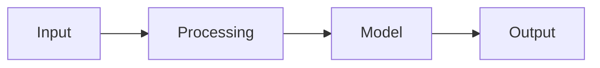

# Project Name

## Problem

## Users and success metric

## Architecture

## Quickstart

## Baseline and results

| Version | Change | Metric | Latency | Cost |
|---|---|---:|---:|---:|
| baseline | — | | | |

## Failure modes and safety

## What I would improve next

## Interview story

- Situation:
- Task:
- Action:
- Result:
